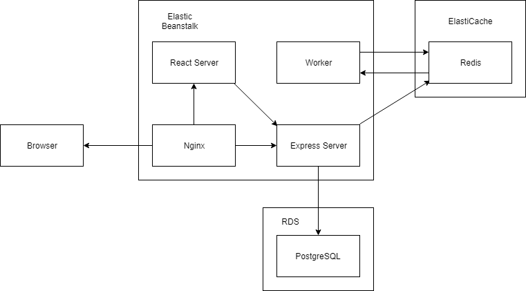

# Intro

A small app to practice with muti-container Docker / AWS.
This Fibonacci Calculator is implemented with Matrix Exponentiation Algorithm.

Tech stacks: Docker, TypeScript, React, Semantic UI, Nginx, Node.js, Express, Redis, PostgresSQL, Travis CI, AWS (Elastic Beanstalk, RDS (PostgresSQL), ElastiCache (Redis), S3 Storage, VPC)

# Demo

http://fibonacci.us-west-2.elasticbeanstalk.com/

# App architecture

